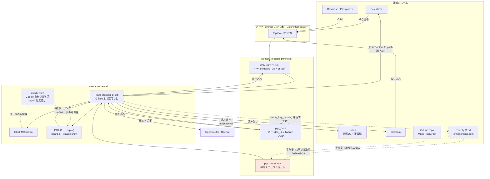
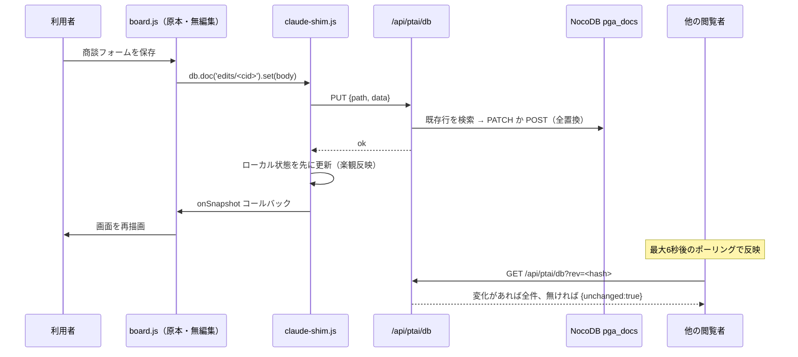
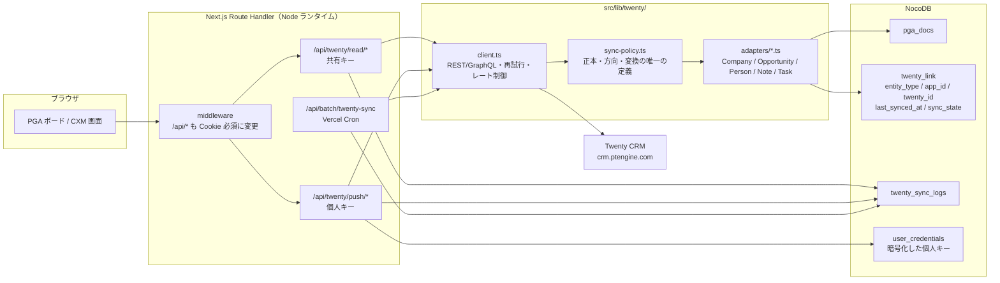

# 現状調査レポート — CXM Platform / Ptengine AI パイプライン と Twenty CRM 連携

- 作成日：2026-09-30
- 調査対象：`Kubotie/cxm`（main `8467908`）／本番 `https://cxmx.vercel.app`
- 調査方法：コード・設定・DB 定義・環境変数参照箇所の読み取り、型チェックとビルドの実行、本番エンドポイントへの読み取り専用プローブ、Twenty ホストへの未認証プローブ
- **本レポート作成にあたりアプリのコード・スキーマ・依存関係・環境変数・Vercel 設定は一切変更していない**
- 秘密情報の値は記載していない（環境変数は名前と用途のみ）

---

## 1. エグゼクティブサマリー

### 1-1. 結論

| 問い | 答え |
|---|---|
| Twenty 連携は実装されているか | **されていない。** 実行時に Twenty を呼ぶコードはゼロ。`/ptai-pipeline` が表示している Twenty 由来データは、2026-09-28 に手作業で取得した**静的スナップショット** |
| 連携を始める最大の障害は何か | 技術ではなく**セキュリティ**。現状の本番は、ログインなしで顧客データが読める状態にある（§6）。この上に Twenty の書き込み権限を載せるのは危険 |
| Twenty 側の API は使えるか | **使える。** `https://crm.ptengine.com` で REST・GraphQL・Metadata GraphQL がすべて応答する（appVersion 0.2.1）。認証トークンだけが足りない |
| 最初に実装すべきものは何か | ①API 認可の穴を塞ぐ ②`twenty_id` ↔ アプリ内 ID の対応表 ③読み取り専用の Twenty クライアント |

### 1-2. 重大な発見（詳細は §6）

| # | 重大度 | 内容 |
|---|---|---|
| S-1 | **Critical** | 146 本の API のうち **92 本に認可チェックが無い**。middleware は `/api/*` を素通しするため、これらは**未認証で誰でも叩ける**。本番で実測確認済み |
| S-2 | **Critical** | 全 11 アカウントが**共有パスワードのみ**で、`APP_PASSWORD` が Vercel に未設定。**コードに直書きされた既定値**が実際のパスワードで、それが**公開リポジトリ**に載っている |
| S-3 | **High** | セッション Cookie が**署名なしの平文識別子**。`cxm_user_uid=<name2>` を自分でセットするだけで任意ユーザーになりすませる（PGA の承認者権限を含む） |
| S-4 | **Medium** | `canAccess()`（RBAC）が定義されているだけで**どこからも呼ばれていない**。ロールは事実上機能していない |
| S-5 | **Medium** | Cookie に `Secure` 属性が付いていない |
| S-6 | **Medium** | 公開リポジトリのコード・設計書に実顧客名・Salesforce ID・議事録の発言が含まれる |

### 1-3. Twenty 連携の前提となる訂正

依頼文の `https://crm.ptmind.com` は **Twenty のフロントエンド（SPA）** で、API パスはアプリの HTML を返します。**API のホストは `https://crm.ptengine.com`** です（`/client-config` の `frontDomain` も `crm.ptengine.com`）。実測は §13-3。

---

## 2. 技術構成

| 項目 | 実測値 | 根拠 |
|---|---|---|
| フレームワーク | Next.js **15.3.9** | `package.json` |
| ルーティング | **App Router のみ**（`pages/` は存在しない）。ルートグループ 2 本立て `(cxm)` / `(ptai)` で**ルートレイアウトが 2 つ** | `src/app/(cxm)/layout.tsx`, `src/app/(ptai)/layout.tsx` |
| React | 18.3.1 | `package.json` |
| TypeScript | 5.8.3。`strict: false`、`noEmit`、パスエイリアス `@/* → ./src/*` | `tsconfig.json` |
| UI | Radix UI（26 パッケージ）＋ shadcn/ui 形式、MUI 7.3.5、lucide-react、recharts、tiptap、motion、sonner | `package.json`, `src/components/ui/` |
| CSS | **Tailwind CSS v4**（`@tailwindcss/postcss`）。`(ptai)` 側は Tailwind を使わず原本の素の CSS | `src/app/globals.css`, `src/app/(ptai)/board.css` |
| 状態管理 | **ライブラリなし**。React の `useState`/`useEffect` と `fetch`。SWR/React Query/Redux は不採用 | `package.json` |
| 認証 | **自前の Cookie セッション**。NextAuth 等は不使用 | `src/lib/auth/session.ts` |
| DB | **NocoDB**（`odtable.ptmind.ai`、Postgres バックエンド）を REST 経由で利用。**ORM なし**。Prisma は依存にすら無い | `src/lib/nocodb/client.ts` |
| ストレージ | Vercel Blob（`@vercel/blob`） | `src/lib/blob/` |
| API 実装 | **App Router の Route Handler のみ 146 本**。**Server Action は 0 本**（`"use server"` の該当なし） | `find src/app/api -name route.ts` |
| デプロイ | Vercel（`kuboties-projects/cxm_x`）。**Git 連携なし・CLI から手動デプロイ**。Cron 8 本 | `.vercel/project.json`, `vercel.json` |
| Lint | **未設定**。`npm run lint` は ESLint の対話セットアップを起動する（設定ファイルが存在しない） | §13-1 |
| 型チェック | スクリプト未定義だが `npx tsc --noEmit` は**エラー 0** | §13-1 |
| テスト | **存在しない**（`test` スクリプトなし、テストランナーも依存に無し、テストファイル 0 件） | §13-1 |
| CI/CD | **なし**（`.github/` が存在しない） | `ls .github` |
| パッケージマネージャ | **npm**（`package-lock.json` のみ。pnpm/yarn/bun のロックは無し） | §13-1 |

### 2-1. 主要ディレクトリ

| パス | 役割 |
|---|---|
| `src/app/(cxm)/` | CXM（顧客成功管理）の画面。独自ルートレイアウト＋Tailwind |
| `src/app/(ptai)/` | Ptengine AI パイプラインボード。**独自ルートレイアウト**。原本アーティファクトの CSS/HTML/JS をそのまま動かす |
| `src/app/api/` | Route Handler 146 本。両プロダクト共通の置き場 |
| `src/lib/nocodb/` | NocoDB アクセス層（46 テーブル分のクライアント・型・読み書き） |
| `src/lib/salesforce/` | **既存の外部 CRM 連携**。Twenty 連携の設計の先例になる（§7-3） |
| `src/lib/ptai/` | PGA 共有ドキュメントストア |
| `src/lib/churn/` | 解約レーダー（判定ルール・バックテスト・言質抽出） |
| `src/lib/{ai,anthropic,openai,prompts}/` | AI 呼び出しとプロンプト |
| `src/components/` | UI。`ui/` が shadcn 由来のプリミティブ |
| `public/ptai-pipeline/` | PGA の原本 JS と `window.claude` 互換シム |
| `docs/v2-architecture/` | CXM の設計ドキュメント 12 本 |
| `docs-src/` | 設計メモ（`.vercelignore` でデプロイ対象外。git には含まれる） |

---

## 3. 現在の機能一覧

### 3-1. 共通・認証

| 機能 | 実装状況 | 関連ファイル | データソース | 備考 |
|---|---|---|---|---|
| サインイン | 実装済み | `src/app/api/auth/login/route.ts`, `src/components/pages/login-page.tsx` | NocoDB `staff_identify` | scrypt ハッシュ照合＋**共有パスワードのフォールバック**。現状は全員がフォールバック経路（S-2） |
| サインアウト | 実装済み | `src/app/api/auth/logout/route.ts` | — | Cookie を Max-Age=0 で消すだけ |
| セッション | 実装済み | `src/lib/auth/session.ts` | Cookie `cxm_user_uid` / `cxm_user_role` | **署名なし**（S-3） |
| ルート保護 | 部分的 | `src/middleware.ts:13` | Cookie 有無のみ | **`/api/*` は素通し**（S-1） |
| プロダクト選択 | 実装済み | `src/app/(cxm)/apps/page.tsx` | — | ログイン後の着地。CXM ⇄ PGA の入口 |
| ユーザー一覧・プロフィール | 実装済み | `src/app/api/user/profile`, `/api/users` | `staff_identify` | role / team / focus_areas を保持 |
| 権限（RBAC） | **定義のみ・未適用** | `src/lib/auth/role.ts` | — | `canAccess()` の呼び出し元が存在しない（S-4） |
| 組織・テナント分離 | **なし** | — | — | 単一テナント前提。全ユーザーが全企業を見られる |

### 3-2. CXM（`/v2` 系）

| 機能 | 実装状況 | 関連ファイル | データソース | 備考 |
|---|---|---|---|---|
| ホーム（日次ダイジェスト） | 実装済み | `src/app/(cxm)/v2/home-view.tsx`, `/api/home/digest` | NocoDB＋Metabase CSV | |
| 企業一覧・個社詳細 | 実装済み | `(cxm)/v2/companies/**`, `/api/company/[companyUid]/**`（20 本超） | NocoDB `companies` ほか | 主キーは `company_uid = sf_<SFアカウントID>` |
| 提案準備ボード | 実装済み | `(cxm)/v2/readiness`, `/api/companies/proposal-board` | NocoDB 集約 | |
| プロジェクト分析 | 実装済み | `(cxm)/v2/projects/**`, `/api/projects/**` | `project_info`, `project_metrics`, `project_user_snapshots` | |
| 解約レーダー | 実装済み | `(cxm)/v2/radar/**`, `src/lib/churn/**`, `/api/radar/**` | `churn_radar_state/events/voice` | 日次バッチが判定、画面は読むだけ |
| Tier3 管理 | 実装済み | `(cxm)/v2/tier3`, `/api/companies/tier3-dashboard` | NocoDB | |
| サポート（Intercom / CSE） | 実装済み | `(cxm)/support/**`, `/api/support/**`（20 本超） | `log_intercom`, `cse_tickets` | |
| アクション（ToDo） | 実装済み | `/api/actions/**`, `/api/company/[uid]/actions/**` | `company_actions` | **Salesforce Task へ片方向 push** |
| 連絡先（People） | 実装済み | `/api/company/[uid]/people/**` | `company_people`, `people` | **Salesforce Contact へ片方向 push** |
| AI サマリ・提案生成 | 実装済み | `src/lib/summary/`, `src/lib/prompts/`, `/api/company/[uid]/summary/**` | OpenRouter / OpenAI | |
| AI チャット | 実装済み | `src/components/ai/`, `/api/ai/chat/**` | OpenRouter | 全ページ共通のサイドパネル |
| 資料・ドキュメント生成 | 実装済み | `/api/assets/**`, `/api/documents/**`, `src/lib/pptx/`, `deck-templates` | Vercel Blob＋NocoDB | |
| アウトバウンド配信 | 実装済み | `(cxm)/outbound`, `/api/outbound/**` | `outbound_campaigns/audiences`＋Intercom | |
| バックグラウンド処理 | 実装済み | `/api/batch/**` 18 本 | — | Vercel Cron 8 本＋DolphinScheduler から手動起動 |
| 検索・絞り込み | 部分的 | 各画面のクライアント側フィルタ | — | 全文検索は無い。一覧のフィルタ・ソートのみ |

### 3-3. Ptengine AI パイプライン（`/ptai-pipeline`）

| 機能 | 実装状況 | 関連ファイル | データソース | 備考 |
|---|---|---|---|---|
| ボード本体（KPI・ファネル・企業一覧・ドロワー 6 タブ） | 実装済み | `public/ptai-pipeline/board.js`（原本 2,545 行）, `src/app/(ptai)/ptai-pipeline/markup.ts` | 下記 | claude.ai アーティファクト V74 の移植。ロジックは無編集 |
| **企業・商談・ノートの読み込み** | **静的スナップショット** | `/api/ptai/raw` → NocoDB `pga_docs/_raw` | **2026-09-28 時点の固定データ 125 社** | **実行時に Twenty を読んでいない**（最大の未実装点） |
| 商談・サクセスの入力／保存 | 実装済み | `/api/ptai/db`, `src/lib/ptai/store.ts` | NocoDB `pga_docs` | `set` は全置換・後勝ち |
| リアルタイム共有 | 実装済み（代替） | `public/ptai-pipeline/claude-shim.js:59` | — | Firestore の `onSnapshot` を**6 秒ポーリング＋内容ハッシュ比較**で代替 |
| 承認フロー（契約確定） | 実装済み | `/api/ptai/me` | `staff_identify` | `name2 === 'Utty'` 判定。Cookie 偽装で突破可能（S-3） |
| AI（組織図・直近の動き・サクセス案） | 実装済み | `/api/ptai/ai` | OpenRouter（`anthropic/claude-sonnet-4-5`） | 本番で稼働実績あり |
| 外部資料の収集 | 実装済み | `/api/ptai/mcp` | Notion REST, Intercom REST | 議事録・会話を AI のプロンプトに入れる |
| **Twenty への書き込み** | **未実装** | `src/app/api/ptai/mcp/route.ts:48-52` | — | `twenty_key_missing` を返し「同期待ち」に落とすだけ |
| 企業追加 → Notion 作成 | 実装済み | `/api/ptai/mcp`（`notion-create-pages`） | Notion API | Twenty 側は同期待ちのまま |

### 3-4. モック・ハードコードされたデータ

| 対象 | 場所 | 性質 |
|---|---|---|
| PGA の企業・商談・ノート 125 社 | NocoDB `pga_docs/_raw`（元は原本 HTML 1353 行） | **実データだが固定スナップショット**。更新されない |
| 共有パスワードの既定値 | `src/app/api/auth/login/route.ts:20` | ハードコード（S-2） |
| PGA テーブル ID の既定値 | `src/lib/ptai/store.ts:15` | ハードコード（秘密ではない） |
| NocoDB テーブル ID の既定値 | `src/lib/nocodb/client.ts` 複数 | ハードコード（秘密ではない） |
| 業界ポテンシャル表・メンバー名・フェーズ定義 | `public/ptai-pipeline/board.js` | マスタ相当のハードコード |
| 実顧客名 | `src/lib/churn/*`, `src/lib/company/super-login.ts`, `docs-src/cxm_v2/19_*` | コメント・設計書内の実名（S-6） |

---

## 4. データモデル

### 4-1. 2 つの独立したデータ空間

このリポジトリには**識別子の体系が異なる 2 つのデータ空間**が同居しています。**両者をつなぐ対応表は存在しません。**

| | CXM | Ptengine AI パイプライン |
|---|---|---|
| 企業の主キー | `company_uid` = **`sf_<Salesforce Account ID>`**（例 `sf_001EXAMPLE0000001`） | `cid` = **Twenty Company の UUID**（例 `0321d20b-ec31-4a4d-8b2b-188caa9cd497`） |
| 格納先 | NocoDB 46 テーブル（正規化された列） | NocoDB `pga_docs` 1 テーブル（collection/doc_id/JSON） |
| 外部 CRM | Salesforce（片方向 push） | Twenty（未接続） |
| 正本 | 項目ごとに異なる（§4-4） | ダッシュボードの入力が正本。Twenty 由来はスナップショット |

### 4-2. NocoDB テーブル（46 件、`src/lib/nocodb/client.ts`）

用途別の主なもの。すべて環境変数でテーブル ID を差し替える構造で、未設定のテーブルは**静かに無効化**される。

| 分類 | テーブル |
|---|---|
| コア | `companies`, `people`, `company_people`, `staff_identify`, `project_info`, `project_metrics` |
| フェーズ | `csm_customer_phase`, `crm_customer_phase` |
| アラート・シグナル | `alerts`, `evidence`, `support_alerts`, `unified_log_signal_state`, `company_situations` |
| 解約レーダー | `churn_radar_state`, `churn_radar_events`, `churn_radar_voice`, `churn_retrospective_reports` |
| ログ取り込み | `log_intercom`, `log_chatwork`, `log_slack`, `log_notion_minutes`, `cse_tickets` |
| スナップショット | `company_daily_snapshot`, `project_user_snapshots`, `chronic_silent_snapshots` |
| AI・生成物 | `company_summary_state`, `proposal_outlines`, `csm_assets`, `csm_documents`, `ai_config` |
| 運用 | `audit_logs`, `company_mutation_logs`, `policies` |
| アウトバウンド | `outbound_campaigns`, `outbound_audiences`, `company_channel_identify` |
| **PGA** | **`pga_docs`** |

### 4-3. `pga_docs` の構造

物理スキーマは 1 枚（`Id / collection / doc_id / data(LongText JSON) / at / updated_at_s / deleted`）。論理的には 9 コレクション＋RAW。

| collection | doc_id | 主なフィールド |
|---|---|---|
| `edits` | Twenty Company UUID | `opp{phase, addMrr, applyDate, billingDate, ms{}, na, barrier, log[]}`, `deals[]`, `company{aim, tier, ind, twentyPending, keyDates}`, `syncedAt` |
| `aplans` | 同上 | `quarters{}`, `items[]`, `ai{}` |
| `orgs` | 同上 | `nodes[{id, name, title, parent, role, inf, stance, contact}]`, `memos[]` |
| `recent` | 同上 | `summary`, `overview{}`, `events[]`, `sources{}`, `genAt` |
| `feed` | 自動 ID | `at`, `cid`, `company`, `kind`, `from`, `to`, `by` |
| `newcos` | 自動 ID | `name`, `dom`, `tier`, `ind`, `owners[]`, **`sync{notion, twenty}`**, **`twentyId`** |
| `settings` | `targets` | `targetMrr`, `targetDue`, `targets{}` |
| `plans` / `chatwork` | — | 旧機能・未使用（0 件） |
| `_raw` | `0000`〜`0004` | RAW スナップショットを 50KB 分割（`src/lib/ptai/store.ts:22`） |

### 4-4. 正本（source of truth）の現状

| データ | 正本 | 従 |
|---|---|---|
| 企業マスタ（CXM） | Salesforce → NocoDB `companies` へ取り込み | CXM 画面 |
| アクション（ToDo） | **CXM** | Salesforce Task（片方向 push、`sf_todo_id` で対応付け） |
| 連絡先 | **CXM** `company_people` | Salesforce Contact（片方向 push、`sf_contact_id`） |
| 企業マスタ（PGA） | **Twenty**（ただし 2026-09-28 のスナップショットで凍結） | — |
| 現在MRR・主担当 | **Notion 顧客 DB** | RAW に取り込み済み |
| 商談フェーズ・追加MRR・到達予定・商談NA | **PGA ダッシュボード（`pga_docs/edits`）** | Twenty（未同期） |
| WHAT カタログ | Notion | CXM |

### 4-5. 既に存在する「外部 ID・同期状態」フィールド

Twenty 連携でも同じ設計を踏襲できます。

| フィールド | 対象 | 意味 |
|---|---|---|
| `sf_account_id` | `companies`, `staff_identify` | Salesforce Account / User ID |
| `sf_todo_id`, `sf_todo_status`, `sf_last_synced_at` | `company_actions` | SF Task の ID・状態・最終同期時刻 |
| `sf_contact_id` | `company_people` | SF Contact ID |
| `pga_docs/edits.syncedAt` | PGA | **null = 未同期**。Twenty 反映済みかの判定に使う想定 |
| `pga_docs/edits.company.twentyPending` | PGA | Tier・業種を編集して Twenty 未反映 |
| `pga_docs/newcos.sync.twenty`, `.twentyId` | PGA | `pending`/`done`/`error` と作成された Twenty レコード ID |

`syncedAt` / `twentyPending` / `twentyId` は**枠だけ用意されていて書き手が存在しない**状態です。

---

## 5. 現在のデータフロー



### 5-1. 書き込み経路（PGA の例）



### 5-2. 削除経路

- CXM：`nocoDelete` / `nocoDeleteWhere`（`src/lib/nocodb/write.ts`）。論理削除と物理削除が混在
- PGA：`doc.delete()` は**物理削除**。原本では旧 `plans` にしか使われていない。`newcos` は `deleted` フラグ
- **Twenty 側の削除・アーカイブを受け取る仕組みは無い**

### 5-3. データ分離

**ユーザー単位・組織単位のデータ分離は実装されていません。** ログインすれば全ユーザーが全企業・全商談を読み書きできます。`staff_identify.excluded_company_uids` は「自分の一覧から隠す」表示上の設定であって、アクセス制御ではありません。

---

## 6. 認証・権限・セキュリティ

### S-1（Critical）API の認可欠落

middleware は冒頭で API を除外します。

```
src/middleware.ts:13
  if (pathname.startsWith('/api/')) return NextResponse.next();
```

コメント上は「各 API ハンドラが 401/404 を返す」前提ですが、**146 本中 92 本にその実装がありません**（`getUserUidFromCookie` / `getCurrentUserProfile` / `checkBatchAuth` / `checkCronOrBatchAuth` のいずれも参照していない route.ts の数）。

本番での実測（2026-09-30、Cookie なし・ヘッダなしの `GET`）：

| エンドポイント | 結果 |
|---|---|
| `/api/nocodb/companies` | **200 / 19KB**。企業名・Tier・担当・リスク判定を含む JSON |
| `/api/companies/proposal-board` | **200 / 192KB** |
| `/api/company-summary-list` | **200 / 114KB** |
| `/api/home/digest` | **200**（担当者名を含む） |
| `/api/ptai/db` | 401 ✅ |
| `/api/ptai/raw` | 401 ✅ |
| `/api/user/profile` | 404（セッション無し）✅ |

同じ理由で、認可の無い `POST`/`PATCH`/`DELETE` 系（`/api/company/[uid]/summary/save`、`/api/actions/[actionId]`、`/api/assets/upload` 等）も未認証で到達可能と推定されます。**本番データを壊すため書き込みの実証は行っていません。**

> 対処案：middleware の `/api/` 除外を、`/api/auth/*` と Cron 用パスだけの除外に変更し、それ以外は Cookie 必須にする。ハンドラ側の個別実装を待たずに一括で塞げます。

### S-2（Critical）共有パスワードの既定値が公開リポジトリにある

```
src/app/api/auth/login/route.ts:20
  const APP_PASSWORD = process.env.APP_PASSWORD ?? '<既定値>';
```

- `APP_PASSWORD` は **Vercel に設定されていません**（`vercel env ls` に該当なし）→ 本番では既定値が使われます
- `staff_identify` の `name2` を持つ **11 アカウント全員が `password_hash` 未設定** → 全員がこの共有パスワードでログインします
- リポジトリ `Kubotie/cxm` は **public** → 既定値は誰でも読めます

つまり現状、**GitHub を見た人は誰でも任意のメールアドレスでログインできます。**

### S-3（High）セッション Cookie が偽装できる

`src/lib/auth/session.ts` の Cookie は `cxm_user_uid=<name2>` という平文で、署名も有効期限検証もありません。`document.cookie` からは読めません（HttpOnly）が、**攻撃者が自分で送る分には何の制約もありません**。本調査でも `curl -b "cxm_user_uid=Kubotie"` だけで認証済みページと PGA API に到達できました。

`cxm_user_role` も同様で、PGA の承認者判定（`name2 === 'Utty'`）も Cookie を書き換えるだけで突破できます。

### S-4（Medium）RBAC が適用されていない

`src/lib/auth/role.ts` の `canAccess(route, role)` は、`role.ts` の外から**一度も呼ばれていません**。Ops 系画面（`/ops/**`）に admin 限定の意図がコメントされていますが、実際には誰でも開けます。

### S-5（Medium）Cookie に `Secure` が無い

`buildSetCookieHeader`（`session.ts:65`）は `Path` / `Max-Age` / `SameSite=Lax` / `HttpOnly` のみ。Vercel は HTTPS 固定なので実害は小さいものの、`Secure` を付けるべきです。有効期限 30 日・サーバー側の失効手段なしという点も併せて弱い。

### S-6（Medium）公開リポジトリに実顧客情報

| 対象 | 場所 |
|---|---|
| A社＋**Salesforce ID**＋解約理由になった議事録の発言 | `docs-src/cxm_v2/19_Churn_Radar_Design.md`（13 箇所）、`src/lib/churn/*`、`src/lib/prompts/churn-voice.ts` |
| B社 | 同設計書、`src/app/(cxm)/v2/companies/[companyUid]/view.tsx:496`、`src/lib/churn/churn-report.ts:6` |
| C社 | `src/lib/company/super-login.ts:9` |

### 良い点（問題のない実装）

- パスワードハッシュは Node 標準の **scrypt**＋`timingSafeEqual`（`src/lib/auth/password.ts`）
- 秘密情報は**すべてサーバー側の環境変数**。`NEXT_PUBLIC_*` の実値は Vercel に 1 件も設定されていない
  - ただし `NEXT_PUBLIC_SUPPORT_BATCH_SECRET` を**参照する**クライアントコードが 3 ファイルある（`src/components/pages/batch-logs.tsx:28` ほか）。**この変数を設定した瞬間にバッチ用シークレットがブラウザバンドルへ焼き込まれる**ので、設定しないこと
- `/nocodb-proxy/*` の rewrite（`next.config.ts:11`）は middleware の保護対象（未認証で 307 → `/login` を実測）
- PGA の 6 本の API はすべて Cookie を検証している
- PGA の顧客データ（`raw.js`）は `.gitignore` 済みで、公開リポジトリには入っていない（実測 0 件）

### 外部 API を追加する際の安全な実装場所

- **クライアント → Twenty の直接呼び出しは禁止。** すべて `src/app/api/**/route.ts`（Node ランタイム）経由にする
- 共有トークンは Vercel の環境変数、個人トークンは NocoDB に AES-256-GCM で暗号化保存（`KEY_ENCRYPTION_SECRET`）
- 先例：`src/lib/salesforce/client.ts`（OAuth client credentials＋トークンキャッシュ）と `src/lib/nocodb/client.ts`（`import` 時にサーバー専用と明記）

---

## 7. Twenty 連携の既存実装

### 7-1. 検索結果

| 検索語 | 該当ファイル |
|---|---|
| `twenty`（大小無視） | `public/ptai-pipeline/board.js`、`src/app/api/ptai/mcp/route.ts`、`src/app/api/ptai/raw/route.ts`、`src/app/(ptai)/ptai-pipeline/markup.ts`、`src/app/(ptai)/board.css`、`scripts/ptai-seed-raw.mjs`、`docs-src/ptai_pipeline/01_Phase1_Report.md` |
| `crm.ptengine.com` | `src/app/(ptai)/ptai-pipeline/markup.ts:10`（画面上の出典表示のみ） |
| `crm.ptmind.com` | **0 件** |
| `graphql` | **0 件** |
| `webhook` | 3 件。いずれも**社内バッチのトリガー用**で Twenty とは無関係（`src/lib/summary/event-trigger.ts` ほか） |
| `sync` / `crm` | Salesforce 連携と NocoDB のテーブル名（`crm_customer_phase`）が大半 |
| Twenty 用の環境変数 | **0 件**。`TWENTY_*` は `.env` / `.env.local` / Vercel のいずれにも無い |

### 7-2. 実際にある「Twenty 向けコード」

| 場所 | 内容 | 状態 |
|---|---|---|
| `src/app/api/ptai/mcp/route.ts:48-52` | `host:twenty` を受けたら **`twenty_key_missing` を返すだけ** | **意図的なスタブ**。Phase 3 で実装予定 |
| `public/ptai-pipeline/board.js:314-333` | `ncSyncTwenty()`：`create_one_company` を呼ぶクライアント側コード | **呼び出し先が無い**ため必ず失敗 →「同期待ち」 |
| `public/ptai-pipeline/board.js:289` | `NC_OWN_TWENTY`：呼称 → Twenty の `pgaOwner` enum 対応表 | 使われるが送信先が無い |
| `public/ptai-pipeline/board.js:1194` | 値の出所バッジ `edit`（入力済み・Twenty 未反映）/ `twenty`（Twenty の値）/ `est` | **UI 側は同期状態を表示する準備ができている** |
| `public/ptai-pipeline/board.js:746-754` | 「作成できない項目」セクション。Twenty 側のスキーマ不足を列挙 | 開発者向けの TODO 一覧そのもの |
| `public/ptai-pipeline/board.js:947` | 「Twenty の People への書き込みは、スキーマ承認と再接続後に行います」 | 未実装の明示 |
| `src/lib/ptai/store.ts` | `edits.syncedAt`・`company.twentyPending`・`newcos.sync.twenty`・`twentyId` を**素通しで保存** | 枠だけあり、書き手が無い |

### 7-3. 参考になる先例：Salesforce 連携

Twenty 連携はゼロからではなく、`src/lib/salesforce/` の構造をなぞれます。

| ファイル | 役割 | Twenty での対応物 |
|---|---|---|
| `client.ts` | OAuth トークン取得・キャッシュ・`sfFetch`/`sfQuery`・レート/エラー処理 | `src/lib/twenty/client.ts` |
| `sync-policy.ts` | **フィールド単位の正本・方向・キー・変換表を 1 ファイルに集約**。「adapter / route / UI は独自判断を持たない」と明記 | `src/lib/twenty/sync-policy.ts` |
| `salesforce-contact-adapter.ts` / `salesforce-task-adapter.ts` | 双方向の型変換 | `twenty-company-adapter.ts` ほか |
| `/api/company/[uid]/actions/[actionId]/sf-push` | 手動 push の入口 | `/api/twenty/push/*` |
| `/api/ops/sf-contacts/batch-sync`, `/api/ops/salesforce/health` | 一括同期・疎通確認の ops 画面 | 同様に用意する |

---

## 8. Twenty 連携のギャップ

| 項目 | 現状 | 不足しているもの | 推奨方針 | 優先度 |
|---|---|---|---|---|
| Twenty API の認証 | 実装ゼロ。環境変数も無い | API キーの発行・保管・注入 | Read は共有キー（`TWENTY_API_URL` / `TWENTY_READ_API_KEY` を Vercel 環境変数）。Write は**操作者本人の個人キー**を NocoDB に AES-256-GCM で暗号化保存（`KEY_ENCRYPTION_SECRET`）。ブラウザには一切渡さない | **最高** |
| オブジェクトのマッピング | RAW の短縮キー ↔ Twenty フィールドの対応表が**ドキュメントにだけ**存在 | コード上の単一の対応表 | `src/lib/twenty/sync-policy.ts` を新設し、`sync-policy.ts`（SF 版）と同じ「正本・方向・キー・変換」の形式で定義 | 高 |
| Twenty レコード ID の保持 | Company は `pga_docs` の `doc_id` がそのまま Twenty UUID。Opportunity は `edits.opportunityId`。Person・Task・Note は**保持先が無い** | People / Task / Note 用の ID 欄、および `twenty_id ↔ company_uid` 対応表 | `pga_docs` に `links` コレクションを足すか、NocoDB に `twenty_link` テーブルを新設（`entity_type, app_id, twenty_id, last_synced_at, sync_state`） | 高 |
| 初回インポート | 手作業の 1 回きり（2026-09-28）。再現スクリプトは**リポジトリに無い**（元スクリプトは作成者のローカル） | サーバー側の取得・整形・保存処理 | `/api/batch/twenty-import` を新設し、既存の `scripts/ptai-seed-raw.mjs` が書いている `pga_docs/_raw` を置き換える。スキーマは現行 RAW 互換にして board.js を触らない | 高 |
| 差分同期 | 無し | `updatedAt` によるカーソル | Twenty の `updatedAt` でフィルタし、`sync_cursor` を `pga_docs/settings` に保存。まず Twenty → アプリの片方向から | 中 |
| アプリ → Twenty 書き込み | 無し（`twenty_key_missing` を返すのみ） | 書き込みクライアントとキュー | 確度「高」の項目（Tier・業種・新規企業・商談名・ニーズ）から。**ドライランのフラグを最初に入れる** | 中 |
| Twenty → アプリ反映 | 無し | 取り込みと画面反映 | 上記の差分同期に同居。`edits` の入力値は上書きしない（フィールド単位の正本に従う） | 中 |
| Webhook / 定期同期 | どちらも無し。Twenty 側の webhook 可否は未確認 | 起動トリガー | まず **Vercel Cron（既に 8 本の運用実績あり）** で 15〜60 分間隔。Webhook は Phase 4 以降の最適化 | 中 |
| 競合解決 | 無し。PGA の保存は**全置換・後勝ち**（原本仕様） | フィールド単位の勝敗規則 | `sync-policy.ts` で項目ごとに正本を固定する。両側更新時は「アプリ優先＋差分をログ」を既定に | 中 |
| 重複防止・冪等性 | 無し。NocoDB の unique 制約は API 経由では効かない（既知） | 冪等キー | 書き込み前に Twenty 側を社名＋ドメインで検索。`twenty_link` に行が無いときだけ create。同一 `app_id` の同時実行は排他 | 高 |
| 削除・アーカイブ | 受け取る仕組みが無い。PGA の `doc.delete()` は物理削除 | 方針そのものが未定 | **削除は同期しない**（Twenty で消えてもアプリ側は残し `sync_state='orphaned'`）を既定にし、運用で判断 | 低 |
| リトライ・エラー処理 | シムが `unavailable` で 1 回だけ再試行。サーバー側は素の `throw` | 指数バックオフと恒久エラーの切り分け | `src/lib/notion/client.ts` の 429 バックオフ実装（`MAX_RETRY`, `CONCURRENCY`）を流用 | 中 |
| 同期ログ・監視 | `audit_logs` / `company_mutation_logs` テーブルは**あるが Twenty 用には未使用**。`/ops/batch-logs` 画面も既存 | 同期専用のログ | 既存の `company_mutation_logs` の形式に合わせて `twenty_sync_logs` を追加し、`/ops` に一覧を出す | 中 |
| レート制限 | 未確認 | 実測と同時実行制御 | `mutationMaximumAffectedRecords: 100`（`/client-config` で確認済み）を上限に。読み取りは `/rest/batch` の活用を検討 | 中 |
| 権限・組織分離 | **アプリ側に存在しない**（§5-3, S-4） | テナント/ロール設計 | 単一ワークスペース（`isMultiWorkspaceEnabled: false` を確認済み）なので**組織分離は不要**。ただし S-1〜S-4 の是正が Twenty 書き込みの前提 | **最高** |

---

## 9. 推奨アーキテクチャ案



**設計の要点**

1. **`sync-policy.ts` を唯一の真実にする。** Salesforce 連携で既に採用されている作法。route も adapter も UI も独自判断を持たない
2. **`twenty_link` を必ず挟む。** `doc_id = Twenty UUID` という現在の暗黙の前提は Company にしか通用せず、Person・Task・Note で破綻する
3. **RAW のスキーマは変えない。** `/api/ptai/raw` の出力形式を保ったまま供給元だけ差し替えれば、`board.js`（2,545 行・無編集）に手を入れずに Phase 2 が終わる
4. **書き込みは必ずキュー経由。** 既存の `syncedAt` / `twentyPending` / `sync.twenty` を「未同期マーク」として使い、同期処理がそれを拾う
5. **ドライランを最初から入れる。** `TWENTY_SYNC_DRY_RUN=1` でログだけ出す

---

## 10. 実装ロードマップ

### Phase 0 — Twenty の仕様・運用ルール確定

| | |
|---|---|
| 目的 | コードから判断できない事項を潰し、正本の分担を決める |
| 実装内容 | §12 の質問リストを Leevis と解消／API キーを発行して疎通確認／`sync-policy.ts` の下書きをレビュー |
| 完了条件 | 読み取り用キーが発行され、`GET /rest/companies?limit=1` が 200 を返す。フィールド単位の正本表が承認される |
| リスク | Twenty のスキーマ追加（`aimMrr`・障壁・課金開始日など）に承認が要り、Phase 3 の範囲が縮む |
| 依存 | Leevis の判断、Twenty の管理者権限 |

### Phase 0.5 — セキュリティ是正（**Phase 1 より先に必須**）

| | |
|---|---|
| 目的 | Twenty の認証情報を預かれる土台にする |
| 実装内容 | S-1（middleware の `/api/*` 除外を撤回）／S-2（`APP_PASSWORD` を Vercel に設定し個別パスワードへ移行、既定値をコードから削除）／S-3（Cookie を HMAC 署名付きに）／S-5（`Secure` 付与）／リポジトリの private 化 |
| 完了条件 | 未認証で 200 を返す API が 0 本。偽装 Cookie で 401 になる |
| リスク | 認可を一括で有効にすると、Cookie を送っていない内部呼び出しが壊れる可能性 → ステージングで全画面を通す |
| 依存 | なし。**今すぐ着手できる** |

### Phase 1 — 読み取り専用の接続検証

| | |
|---|---|
| 目的 | サーバーから Twenty を読めることを確認する |
| 実装内容 | `src/lib/twenty/client.ts`（REST 優先、`/rest/open-api/core` でスキーマ取得）／`/api/ops/twenty/health`（`/healthz` と 1 件取得）／`/ops` に疎通パネル |
| 完了条件 | ops 画面に Twenty の Company 件数と最新 `updatedAt` が出る。キーはレスポンスにもログにも出ない |
| リスク | REST と GraphQL でフィールド名が異なる可能性 → OpenAPI で確定させる |
| 依存 | Phase 0 のキー |

### Phase 2 — 初回インポート

| | |
|---|---|
| 目的 | RAW スナップショットを実行時取得に置き換える |
| 実装内容 | Company / Opportunity / Note / WorkspaceMember を取得して現行 RAW 互換の JSON を組み立て、`pga_docs/_raw` を更新する `/api/batch/twenty-import`／`twenty_link` テーブル新設／Vercel Cron に追加（日次） |
| 完了条件 | `/ptai-pipeline` の数字が手動スナップショットと一致し、翌日には Twenty の更新が反映される。`board.js` は 1 行も変えていない |
| リスク | Opportunity の `companyId` が全件空で、現状は**商談名「PGA - 会社名」の文字列照合**で紐付けている。ここが壊れると商談が会社に付かない |
| 依存 | Phase 1／Notion 顧客 DB（現在MRR・担当3）の突合ロジック |

### Phase 3 — アプリから Twenty への書き込み

| | |
|---|---|
| 目的 | ダッシュボードの入力を Twenty に反映する |
| 実装内容 | 連携設定画面（個人 API キーの登録・接続テスト・削除、末尾 4 桁のみ表示）／`user_credentials` テーブル／`/api/twenty/push/*`／`/api/ptai/mcp` の `host:twenty` スタブを実装に差し替え／確度「高」の項目から（Tier・業種・新規企業・商談名・ニーズ） |
| 完了条件 | ドライランで差分ログが出る。本番実行で「同期待ち」チップが消える。二重作成が起きない |
| リスク | 冪等性の破れによる重複企業。Baba・Eri・Kubotie が Twenty ワークスペース未登録のため担当者が書けない |
| 依存 | Phase 0 のスキーマ承認、Phase 2 の `twenty_link` |

### Phase 4 — 双方向の差分同期

| | |
|---|---|
| 目的 | 両側の更新を継続的に噛み合わせる |
| 実装内容 | `updatedAt` カーソルによる取り込み／`sync-policy.ts` に沿ったフィールド単位のマージ／競合のログ化／Webhook が使えるなら near-realtime 化 |
| 完了条件 | 両側で同じ企業を更新しても、正本側の値が残り、負けた側が同期ログに残る |
| リスク | PGA の保存が**全置換・後勝ち**なので、取り込みと画面保存が競合すると入力が消える。Phase 4 の前に楽観ロックの導入を検討 |
| 依存 | Phase 3 |

### Phase 5 — 監視・障害復旧・運用整備

| | |
|---|---|
| 目的 | 壊れたことに気づける状態にする |
| 実装内容 | `twenty_sync_logs` と `/ops/twenty-sync` 画面／失敗の再実行ボタン／件数の急変アラート／キーのローテーション手順／CI（型チェックとビルド）の導入 |
| 完了条件 | 同期失敗が 24 時間以内に検知され、手動で再実行できる |
| リスク | 監視を後回しにすると、静かに古いデータを表示し続ける |
| 依存 | Phase 2 以降 |

---

## 11. リスク

| # | リスク | 影響 | 重大度 | 緩和策 |
|---|---|---|---|---|
| R-1 | 現状の本番が未認証で顧客データを返している（S-1） | 情報漏えい | **Critical** | Phase 0.5。middleware の一括修正で即日塞げる |
| R-2 | 共有パスワードの既定値が公開リポジトリにある（S-2） | 全アカウント乗っ取り | **Critical** | `APP_PASSWORD` の設定＋個別パスワード移行＋リポジトリ private 化 |
| R-3 | Cookie 偽装（S-3） | 承認フローの無効化 | **High** | 署名付きセッションへ |
| R-4 | 上記が未解決のまま Twenty の書き込み権限を載せる | **CRM 本体のデータ破壊** | **Critical** | Phase 0.5 を Phase 3 の前提条件にする |
| R-5 | PGA の保存が全置換・後勝ち | 同時編集で入力消失 | High | Phase 4 の前に楽観ロック。当面は運用で回避 |
| R-6 | Opportunity の紐付けが社名の文字列照合 | 商談が会社に付かない | High | Phase 2 で `companyId` を埋めるか、`twenty_link` で明示 |
| R-7 | RAW 再構築スクリプトがリポジトリに無い | Phase 2 を書き起こす必要がある | Medium | 設計書（§5-3 対応表）と `reference/` から再構築。作成者のローカルに原典あり |
| R-8 | テスト・Lint・CI がゼロ | 回帰に気づけない | Medium | Phase 5 で型チェックとビルドだけでも CI に載せる |
| R-9 | Twenty の stage が 5 段階、ダッシュボードは 8 段階で不一致 | フェーズ同期ができない | High | Phase 0 で対応表を確定。不可なら Company のカスタム項目に持つ |
| R-10 | Vercel が Git 連携されておらず CLI 手動デプロイ | **未マージのローカル状態を本番に上げる事故が実際に発生**（2026-09-30、PGA が本番から消えた） | High | Git 連携を有効にするか、デプロイ前に `git status` を確認する手順を明文化 |
| R-11 | `NEXT_PUBLIC_SUPPORT_BATCH_SECRET` を設定するとバッチ秘密がブラウザに焼き込まれる | 権限昇格 | Medium | この変数を設定しない。参照している 3 ファイルをサーバー経由に直す |

---

## 12. 未確認事項・質問

### 12-1. コードから確認できた（質問不要になった）事項

| 項目 | 実測結果 |
|---|---|
| API のホスト | **`https://crm.ptengine.com`**。`crm.ptmind.com` は SPA を返すだけで API パスが通らない |
| 利用可能な API 方式 | **REST（`/rest/*`）・GraphQL（`/graphql`）・Metadata GraphQL（`/metadata`）・一括（`/rest/batch`）がすべて応答** |
| API ドキュメント | `/rest/open-api/core`・`/rest/open-api/metadata`（OpenAPI。認証が要る） |
| バージョン | **appVersion 0.2.1** |
| ワークスペース | **単一**（`isMultiWorkspaceEnabled: false`、`defaultSubdomain: app`） |
| ログイン方式 | **パスワードのみ**（Google / Microsoft / MagicLink はすべて無効） |
| スキーマ変更の可否 | `isWorkspaceSchemaDDLLocked: false` → **カスタム項目の追加は技術的に可能** |
| 一括更新の上限 | `mutationMaximumAffectedRecords: 100` |
| ヘルスチェック | `/healthz` が `{"status":"ok"}` |

### 12-2. Twenty 側・運用側への質問

| # | 質問 | なぜ必要か |
|---|---|---|
| Q1 | API キーは誰が発行できるか。メンバー個人が自分のキーを作れるか、管理者のみか | Write を個人キーで行う方針（§8）の成否が決まる |
| Q2 | API キーによる操作は Twenty 側のどこに記録されるか（キー名・ユーザー名） | 「誰が変えたか」を CRM 側でも追えるか |
| Q3 | **Webhook は使えるか**。使えるならどのオブジェクト・イベントか | Phase 4 を near-realtime にできるか、Cron 止まりか |
| Q4 | レート制限の実値 | 同時実行数とバッチサイズの決定 |
| Q5 | Opportunity の `companyId` が全件空なのは仕様か、入力漏れか。埋められるか | R-6 の根本解決 |
| Q6 | **Opportunity の `stage`（NEW/SCREENING/MEETING/PROPOSAL）を 8 段階フェーズに揃えられるか。** 揃えられない場合、Company のカスタム項目に持つのは許容されるか | R-9。Phase 3 の中心 |
| Q7 | カスタム項目の追加は承認されるか（`aimMrr`・障壁・課金開始日・到達予定・失注理由） | Phase 3 の範囲 |
| Q8 | Note と Company の紐付けは `noteTargets` か。日付はタイトルから抽出する規則か | 議事録タブと AI 資料の再現 |
| Q9 | `netMrr` と `amount` のどちらが金額の正本か | 金額同期 |
| Q10 | 契約状況フィールドの正式名（実データでは `qiYueZhuangKuang` が候補） | 一覧の「Ptengine契約中」列 |
| Q11 | ワークスペースメンバー一覧を取るエンドポイント名 | 担当者の対応付け |
| Q12 | Baba・Eri・Kubotie を Twenty ワークスペースに招待できるか | この 3 名の担当を書き込めるか |
| Q13 | **どちらを正本にするか。** 項目ごとの分担（案：企業マスタ＝Twenty、商談の進行情報＝アプリ） | `sync-policy.ts` の前提 |
| Q14 | 削除・アーカイブの扱い。Twenty で消したらアプリ側も消すか | 削除同期の方針 |
| Q15 | 競合時のルール。両側更新でどちらを残すか | マージ規則 |
| Q16 | 過去データの移行範囲。いつ以降の Note / Opportunity を取り込むか | 初回インポートの量 |
| Q17 | 読み取り専用ロールのキーを発行できるか | Read 用の共有キーを最小権限にできるか |

### 12-3. 社内で決めること

| # | 質問 |
|---|---|
| Q18 | **リポジトリを private にするか。** 現在 public で、実顧客名と共有パスワードの既定値が載っている |
| Q19 | セキュリティ是正（Phase 0.5）を Twenty 連携より先に行うことに同意いただけるか |
| Q20 | CXM（`company_uid = sf_xxx`）と PGA（`cid = Twenty UUID`）の企業を突き合わせるか。するなら対応表を誰が作るか |
| Q21 | Vercel を GitHub 連携に切り替えるか（R-10 の再発防止） |

---

## 13. 実行した検証と結果

### 13-1. 品質確認

| 項目 | コマンド | 結果 |
|---|---|---|
| パッケージマネージャ判定 | ロックファイルの確認 | **npm**（`package-lock.json` のみ。`packageManager` フィールドは未指定） |
| Lint | `npm run lint` | **実行できず。** `next lint` が「How would you like to configure ESLint?」の対話セットアップを開始する。原因：ESLint の設定ファイル（`.eslintrc*` / `eslint.config.*`）が存在せず、`eslint` も依存に無い。**依存追加はしない指示のため中断**（設定ファイルは作成していない） |
| 型チェック | `npx tsc --noEmit -p tsconfig.json` | **成功（エラー 0）**。ただし `tsconfig.json` は `strict: false` |
| テスト | `package.json` / 依存 / ファイル探索 | **テストは存在しない。** `test` スクリプト無し、jest / vitest / playwright / cypress いずれも依存に無し、`src` 配下のテストファイル 0 件 |
| 本番ビルド | `npm run build` | **成功。** `BUILD_ID: FAa5gSOFEdwKppFxpDy2x`。警告：`/api/home/project-signals` の Dynamic server usage（外部 CSV を `no-store` で取得しているため静的化できない旨。既存の想定内） |

> 実行後、`.next` は削除して元の状態に戻した（ビルド成果物と dev サーバーの混在を避けるため）。

### 13-2. 本番エンドポイントのプローブ（読み取りのみ）

§6 S-1 の表を参照。取得したデータの中身はレポートに転記していない。

### 13-3. Twenty ホストのプローブ（未認証・読み取りのみ）

| URL | HTTP | 応答 |
|---|---|---|
| `https://crm.ptmind.com/` | 200 | Twenty の SPA |
| `https://crm.ptmind.com/rest/companies` | 200 | **SPA の HTML**（API ではない） |
| `https://crm.ptmind.com/graphql` | 200 | **SPA の HTML** |
| `https://crm.ptengine.com/` | 200 | Twenty の SPA |
| `https://crm.ptengine.com/rest/companies` | **403** | `{"statusCode":403,"messages":["Missing authentication token"],"error":"FORBIDDEN_EXCEPTION"}` |
| `https://crm.ptengine.com/graphql` | 200 | `{"errors":[{"message":"Must provide query string."}]}` |
| `https://crm.ptengine.com/metadata` | 200 | 同上（Metadata GraphQL が存在） |
| `https://crm.ptengine.com/rest/batch` | 403 | 認証必須 |
| `https://crm.ptengine.com/rest/open-api/core` | 403 | 認証必須（OpenAPI は存在する） |
| `https://crm.ptengine.com/healthz` | 200 | `{"status":"ok"}` |
| `https://crm.ptengine.com/client-config` | 200 | §12-1 の各値 |

---

## 14. 根拠となる主要ファイル一覧

| ファイル | 何の根拠か |
|---|---|
| `package.json` | 依存・スクリプト・テストの不在 |
| `tsconfig.json` | TypeScript 設定（`strict:false`、`@/*` エイリアス） |
| `next.config.ts` | `serverExternalPackages`、`/nocodb-proxy/*` rewrite |
| `vercel.json` | Cron 8 本 |
| `.vercel/project.json` | Vercel プロジェクト `cxm_x` |
| `src/middleware.ts:13` | **`/api/*` を認証から除外している行（S-1）** |
| `src/app/api/auth/login/route.ts:20,36` | **共有パスワードの既定値と照合ロジック（S-2）** |
| `src/lib/auth/session.ts:65-112` | Cookie の生成（署名なし・`Secure` なし。S-3/S-5） |
| `src/lib/auth/password.ts` | scrypt＋`timingSafeEqual` |
| `src/lib/auth/role.ts` | `canAccess()` の定義（呼び出し元なし。S-4） |
| `src/lib/nocodb/client.ts` | NocoDB 46 テーブルの ID と環境変数名 |
| `src/lib/nocodb/write.ts` | 作成・更新・削除のヘルパー |
| `src/lib/nocodb/user-profile.ts` | `staff_identify` の型とロール |
| `src/lib/salesforce/sync-policy.ts` | **既存の外部 CRM 同期ポリシーの作法（Twenty 版の雛形）** |
| `src/lib/salesforce/client.ts` | OAuth・トークンキャッシュ・エラー処理の先例 |
| `src/lib/batch/auth.ts` | `SUPPORT_BATCH_SECRET` / `CRON_SECRET` の使い分け |
| `src/lib/ptai/store.ts` | `pga_docs` のスキーマと `_raw` 分割保存 |
| `src/app/api/ptai/db/route.ts` | PGA の共有 DB API（認可あり） |
| `src/app/api/ptai/raw/route.ts` | **RAW スナップショットの供給元。Phase 2 の差し替え対象** |
| `src/app/api/ptai/mcp/route.ts:48-52` | **`host:twenty` のスタブ（唯一の Twenty 向けサーバーコード）** |
| `src/app/api/ptai/me/route.ts` | 承認者判定 |
| `public/ptai-pipeline/claude-shim.js:59,279` | ポーリング間隔と `window.claude` の公開 |
| `public/ptai-pipeline/board.js:289,314-333,746-754,1194` | Twenty 向けの対応表・同期スタブ・未実装一覧・同期状態バッジ |
| `src/app/(ptai)/ptai-pipeline/markup.ts:10` | 画面に出ている `crm.ptengine.com` の出典表記 |
| `src/components/pages/batch-logs.tsx:28` | `NEXT_PUBLIC_SUPPORT_BATCH_SECRET` の参照（S-6 注記） |
| `docs/v2-architecture/*.md` | CXM の設計 12 本 |
| `docs-src/ptai_pipeline/01_Phase1_Report.md` | PGA 移植の Phase 1 報告（仮定と未解決事項） |
