# Source Context フロー図

> **最終更新**: 2026-03-25
> どこから来て、何を経由して、どこへ届くかを整理した全体フロー。

---

## 全体フロー（Overview）

```mermaid
flowchart TD
    %% ============================================================
    %% 入力元（Sources）
    %% ============================================================
    subgraph SOURCES["📥 入力元（Source Context）"]
        direction TB
        INBOX["📧 Inbox\n問い合わせ・アラート・チケット"]
        COMPANY["🏢 Company Detail\n企業統合理解・健康状態"]
        LOG["📋 Unified Log\nEvidence時系列ビュー"]
        AUDIENCE["👥 Audience\nクラスター・セグメント"]
        PROJECT["📁 Project\nプロジェクト単位"]
    end

    %% ============================================================
    %% 業務フロー（中間処理）
    %% ============================================================
    subgraph WORKFLOW["⚙️ 業務フロー（中間処理）"]
        direction TB
        ACTIONS["✅ Actions\nアクション管理・タスク"]
        CONTENT["✍️ Content\nAI作業場・文面作成"]
        LIBRARY["📚 Library\nTemplate / Playbook / Knowledge"]
    end

    %% ============================================================
    %% 送信フロー（Output）
    %% ============================================================
    subgraph SEND["📤 送信フロー（Output）"]
        direction TB
        OB_LIST["📋 Outbound 一覧\n送信運用の起点\n⚠️ 送信実行しない"]
        COMPOSE["🔴 Compose\n最終送信実行\n唯一の赤ボタン"]
        RESULTS["📊 Results\n効果測定・次アクション"]
    end

    %% ============================================================
    %% Source → 業務フロー
    %% ============================================================
    COMPANY -->|"?fromCompany={id}\n→ Actions に送る"| ACTIONS
    COMPANY -->|"?fromCompany={id}\n→ Content に送る"| CONTENT
    LOG     -->|"?fromEvidence={id}\n→ Action を作成"| ACTIONS
    LOG     -->|"?fromEvidence={id}\n→ Content に送る"| CONTENT
    INBOX   -->|"?fromInbox={id}"| ACTIONS

    %% ============================================================
    %% Source → 送信フロー（直接）
    %% ============================================================
    COMPANY  -->|"?fromCompany={id}\n→ Outbound を起票"| OB_LIST
    COMPANY  -->|"?fromCompany={id}\n→ Outbound を起票"| COMPOSE
    LOG      -->|"?fromLog={id}&type=inquiry_response\n→ Outbound 対応を起票"| COMPOSE
    LOG      -->|"?evidence={id}\n→ Evidence を送信文脈に使う"| COMPOSE
    AUDIENCE -->|"?fromAudience={id}\n→ 送信レビューへ"| COMPOSE
    AUDIENCE -->|"?fromAudience={id}\n→ Outbound を起票"| OB_LIST
    PROJECT  -->|"?fromProject={id}"| OB_LIST

    %% ============================================================
    %% 業務フロー → 送信フロー
    %% ============================================================
    ACTIONS -->|"?fromAction={id}"| COMPOSE
    CONTENT -->|"?fromContent={id}\n→ Outbound で使う"| COMPOSE
    LIBRARY -->|"?fromTemplate={id}"| COMPOSE

    %% ============================================================
    %% 送信フロー内部
    %% ============================================================
    OB_LIST --> COMPOSE
    COMPOSE --> RESULTS

    %% ============================================================
    %% Results → 次アクション（フィードバックループ）
    %% ============================================================
    RESULTS -->|"?followUp={id}\n→ Follow-up Action"| ACTIONS
    RESULTS -->|"再送信・修正"| COMPOSE

    %% ============================================================
    %% スタイル
    %% ============================================================
    style COMPOSE fill:#dc2626,color:#fff,stroke:#b91c1c
    style RESULTS fill:#0f766e,color:#fff,stroke:#0d9488
    style INBOX   fill:#1e40af,color:#fff,stroke:#1d4ed8
    style COMPANY fill:#1e40af,color:#fff,stroke:#1d4ed8
    style LOG     fill:#1e40af,color:#fff,stroke:#1d4ed8
    style AUDIENCE fill:#1e40af,color:#fff,stroke:#1d4ed8
    style PROJECT  fill:#1e40af,color:#fff,stroke:#1d4ed8
```



---

## 送信系 CTA ルール早見表

| 画面 | 役割 | 送信実行 | 赤ボタン |
|------|------|:-------:|:-------:|
| **Company Detail** | 統合理解・次アクション判断 | ❌ | ❌ |
| **Unified Log** | Evidence理解・根拠確認 | ❌ | ❌ |
| **Audience** | 一括施策設計 | ❌ | ❌ |
| **Outbound 一覧** | 送信運用の起点 | ❌ | ❌ |
| **Compose** | **最終送信実行** | ✅ | ✅ |

---

## URL パラメータ一覧

### Source → Outbound / Compose

| 起点 | URL パラメータ | 引き継ぐ主な文脈 |
|------|--------------|----------------|
| Company Detail | `?fromCompany={id}` | phase, healthScore, openAlerts, openActions |
| Company Detail（全社施策） | `?fromCompany={id}&scope=company_wide` | 全Project・全User対象 |
| Company Detail（Salesforce） | `?fromCompany={id}&sync=salesforce&type=org_chart` | 組織図同期対象 |
| Unified Log（問い合わせ対応） | `?fromLog={id}&type=inquiry_response` | evidenceId, urgency, sourceChannel |
| Unified Log（返信対応） | `?fromLog={id}&responseType=reply` | inquiryContent, ticketId, linkedUser |
| Unified Log（文脈として添付） | `?evidence={id}` | evidenceContent, evidenceType |
| Audience | `?fromAudience={id}` | clusterName, audienceConditions, resolvedRecipients |
| Audience（一覧経由） | Outbound一覧 `?fromAudience={id}` | 同上 |

### Source → Actions / Content

| 起点 | URL パラメータ |
|------|--------------|
| Company Detail | `?fromCompany={id}` |
| Unified Log | `?fromEvidence={id}` |
| Inbox | `?fromInbox={id}` |
| Project | `?fromProject={id}` |

### Actions / Content → Compose

| 起点 | URL パラメータ |
|------|--------------|
| Actions | `?fromAction={id}` |
| Content | `?fromContent={id}` |
| Library（Template） | `?fromTemplate={id}` |

### Results → フォローアップ

| 起点 | URL パラメータ |
|------|--------------|
| Results（Follow-up） | `?followUp={id}` |
| Results（編集） | `?edit={id}` |

---

## Source Context 別 引き継ぎデータ構造

```typescript
interface ComposeTransitionContext {
  // どこから来たか
  sourceContext: 'company' | 'unified_log' | 'audience' | 'inbox'
                | 'project' | 'actions' | 'content' | 'library';
  sourceId: string;

  // 紐づくエンティティ
  linkedCompany?:   string[];
  linkedProject?:   string[];
  linkedUser?:      string[];
  linkedEvidence?:  string[];
  linkedAction?:    string;
  linkedContent?:   string;
  linkedCluster?:   string;

  // 対象範囲
  audienceScope?: 'company' | 'project' | 'user';

  // Company 起点時の追加文脈
  companyPhase?:  string;
  healthScore?:   number;
  openAlerts?:    number;
  openActions?:   number;

  // Unified Log 起点時の追加文脈
  inquiryType?:    'inquiry' | 'alert' | 'ticket';
  urgency?:        'high' | 'medium' | 'low';
  sourceChannel?:  'email' | 'slack' | 'intercom' | 'chatwork';
  receivedAt?:     string;
  responseType?:   'reply' | 'guide' | 'support';

  // Audience 起点時の追加文脈
  audienceConditions?: {
    characteristics?: string[];
    risks?:           string[];
    opportunities?:   string[];
  };

  // 送信対象
  targetProjectCount?:    number;
  targetUserCount?:       number;
  resolvedRecipients?:    string[];
  unresolvedRecipients?:  { userId: string; reason: string }[];

  // Salesforce 同期時
  syncType?:   'salesforce';
  syncTarget?: 'org_chart' | 'contact' | 'account';
  syncFields?: string[];
}
```

---

## 関連ドキュメント

- [`cta-refactoring-company-audience.md`](./cta-refactoring-company-audience.md) — Company / Unified Log / Audience 配下の CTA 整理仕様
- [`source-context-display-spec.md`](./source-context-display-spec.md) — Outbound / Compose / Results の表示情報仕様
- [`compose-initial-state-by-source.md`](./compose-initial-state-by-source.md) — Source Context 別 Compose 初期表示仕様
- [`results-quick-reference.md`](./results-quick-reference.md) — Results 画面 Source Context 別クイックリファレンス
